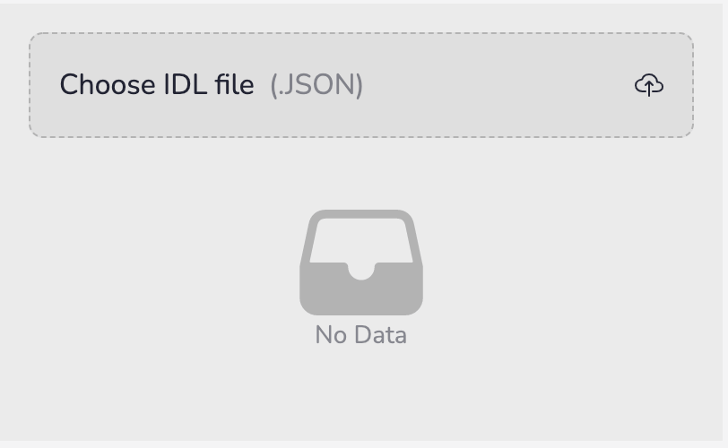
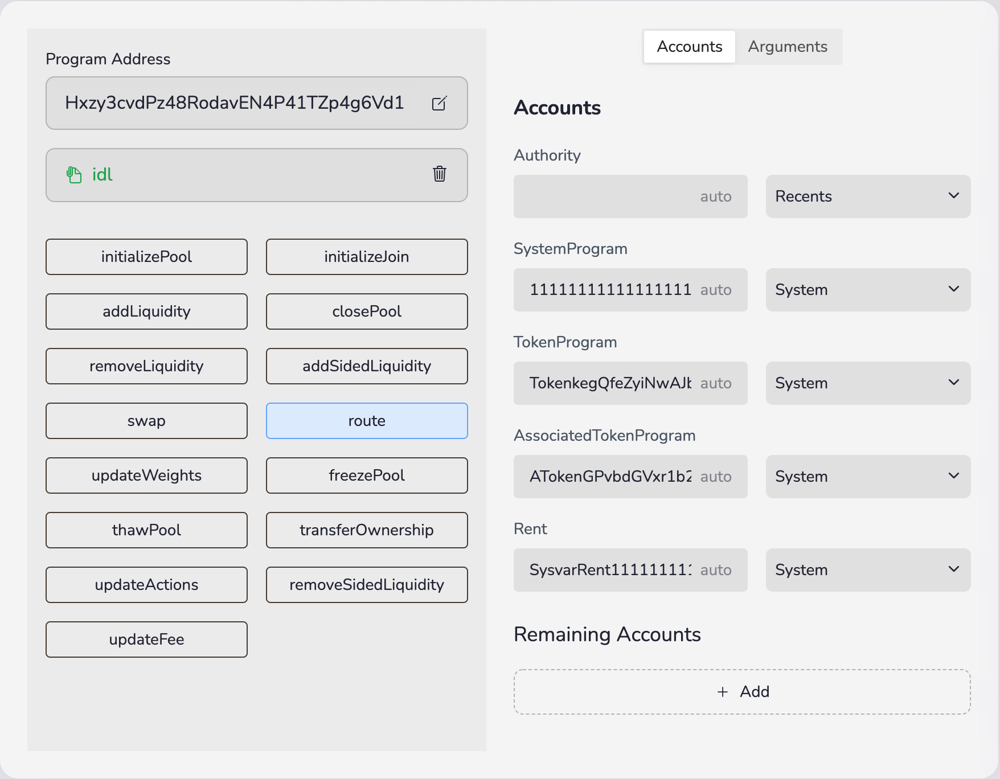
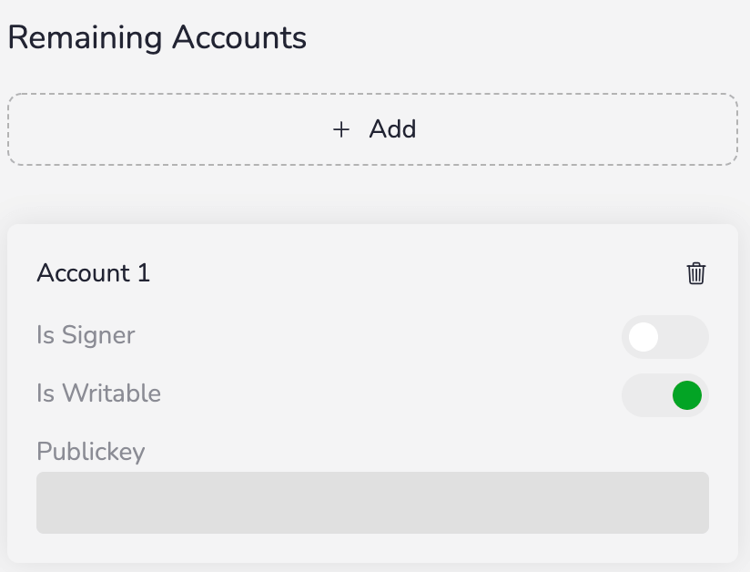
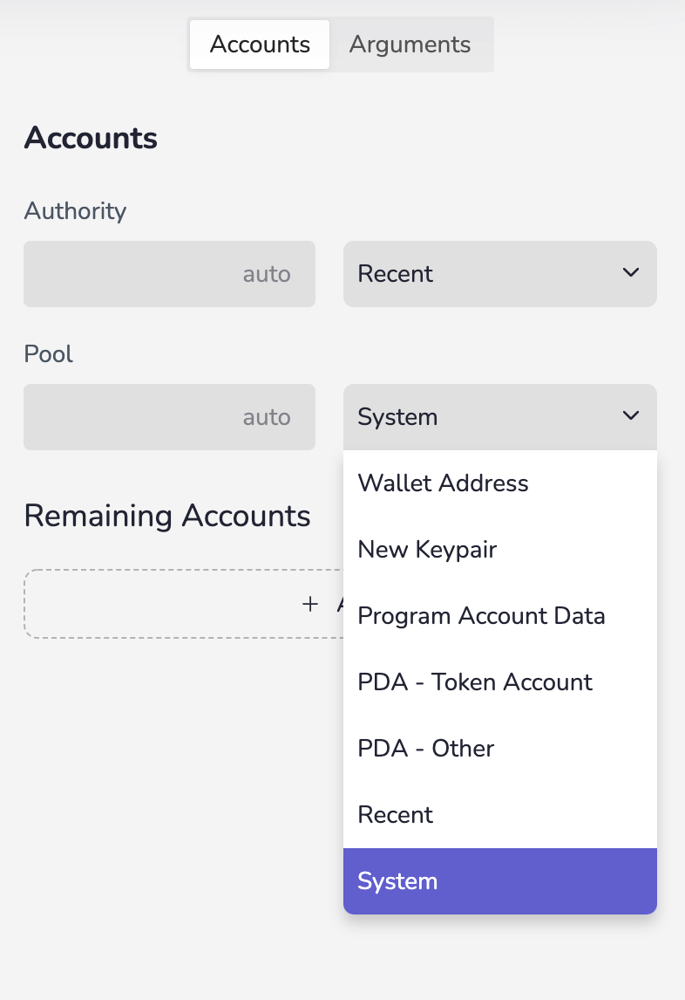
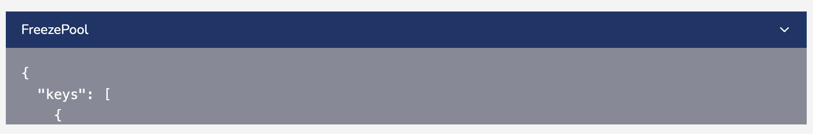
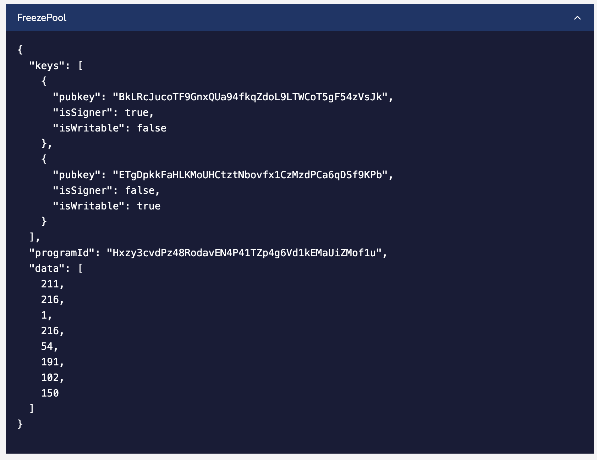

# **IDL Parser**

> Support converting IDL files to `transaction instruction`. Useful for smart contract test run, time-saving for writing test case.

## Install

`yarn add idl-parser-core`

## Usage

```js
import { ParserProvider } from 'idl-parser-core'

const NODE: 'https://api.devnet.solana.com'

const App = () => {
  return (
    <ParserProvider
      connection={NODE}
      walletAddress={walletAddress}
      programAddresses={{ provider }}
    >
      <View />
    </ParserProvider>
  )
}
```

> connection: rpc api url address \
> walletAddress: user wallet address \
> programAddresses: địa chỉ chương trình smartcontract

## Component

_Giao diện mặc định của thư viện idl-parser-core_

#### IDLParserWrapper

> ` import { IDLParserWrapper } from 'idl-parser-core'`

```html
<IDLParserWrapper />
```

- _Giao diện mặc định của thư viện idl-parser-core: upload file idl, form accounts và arguments_

#### TemplateView, InstructionView

> `import { TemplateView, InstructionView } from 'idl-parser-core'`

```html
<TemplateView />

<InstructionView />
```

- _**TemplateView**: Giao diện cấu trúc file IDL được tải lên._
- _**[InstructionView](#instructionview)**: Giao diện mặc định form accounts và arguments của file IDL được tải lên._

#### UploadIdl, ViewUploadedIdl

> `import { UploadIdl, ViewUploadedIdl } from 'idl-parser-core'`

```html
<UploadIdl />

<ViewUploadedIdl />
```

- _**UploadIdl**: Giao diện mặc định để tải lên file IDL._
- **ViewUploadedIdl**: Giao diện mặc định hiển thị file IDL được tải lên.\_

## Hooks

_Cung cấp các function để thao tác với dữ liệu, thêm, sửa, xoá với file IDL được tải lên. Lấy thông tin được điền vào từ form accounts, arguments, hoặc dữ liệu file IDL sau khi chuyển đổi._

- ### useParser

  - **uploadIdl**: function tải lên file IDL
  - **removeIdl:** function xoá file IDL được tải lên
  - **parser**: dữ liệu của file IDL được tải lên
    ```js
    const {
      parser: { idl, ixSelected, accountsMetas, argsMetas, remainingAccounts },
    } = useParser()
    ```
    - **idl**: file IDL được tải lên
    - **accountsMetas**: dữ liệu accounts.
    - **argsMetas**: dữ liệu argsMetas.
    - **ixSelected**: instruction đang được chọn.
    - **remainingAccounts**: dữ liệu remainingAccounts.
  - **connection**: địa chỉ rpc blockchain.
  - **walletAddress**: địa chỉ ví của người dùng.
  - **programAddresses**: địa chỉ chương trình smartcontract.\
    **`programAddress.idl`** địa chỉ program được lấy từ file IDL tải lên.\
    **`programAddress.custom`** địa chỉ program được người dùng thêm, sửa , xoá.\
    **`programAddress.provider`** địa chỉ program bắt buộc thêm vào khi khởi tạo providerParser để thư viện xác định địa chỉ chương trình mà fileIDL đang tương tác.
    ```js
    const {
      programAddress: {
        custom: customProgramAddress,
        idl: idlProgramAddress,
        provider: providerProgramAddress,
      },
    } = useParser()
    ```
  - **setProgramAddress**(programAddress: string): function cài địa chỉ cho chương trình IDL. Địa chỉ chương trình sẽ được thêm vào _`programAddress.custom`_
    ```js
    const {
      programAddress: { custom: customProgramAddress },
    } = useParser()
    ```
  - **setAccountsMeta**({ name: string, data: KeypairMeta }): function thêm dữ liệu cho trường accounts. Dữ liệu sẽ được thêm vào _`parser.accountsMetas`_.
    ```js
    const {
      parser: { accountsMetas },
    } = useParser()
    ```
  - **setArgsMeta**({ name: string, val: string }): function thêm dữ liệu cho trường arguments. Dữ liệu sẽ được thêm vào _`parser.argsMetas`_.
    ```js
    const {
      parser: { argsMetas },
    } = useParser()
    ```
  - **setInstruction**(val: string): function chọn instruction để thao tác. Instruction được chọn sẽ thêm vào _`parser.ixSelected`_.
    ```js
    const {
      parser: { ixSelected },
    } = useParser()
    ```
  - **txInstructions**: transaction instruction được chuyển đổi sau khi điền đầy đủ thông tin accounts, argument và remainning accounts nếu có.
    ```js
    const { txInstructions } = useParser()
    ```
  - **setTxInstructions**: function thêm dữ liệu cho txInstructions.

    ```js
    const { setTxInstructions } = useParser()

    function () {
      ...
      setTxInstructions(instruction)
      ...
    }
    ```

# <a id="guideline" href="javascript:void"></a> Guideline

</br>

### <a id="upload_idl" href="javascript:void"></a> Upload file idl

- Button `Choose IDL file`: select to upload file idl.

<p align="center"></p>

#

</br>

### <a id="idl_instruction" href="javascript:void"></a> IDL instructions

- `Program Address`: địa chỉ chương trình idl đang tương tác.
- `File details`:
  - File name.
  - Icon : click to remove idl file.
- `Group button instructions`: Select instruction wana parse to transaction.
- `Accounts`: Bao gồm những địa chỉ account cần để tạo và thực hiện transaction.
- `Arguments`: Là những giá trị được truyền vào tương ứng với giá trị được yêu cầu của transaction.
<p align="center"></p>

- `Remaining accounts`: Là tham số được dùng trong một số transaction đặc biệt như tạo account, deposit .v.v .Có dạng như sau:

  ```js
    {
      isSigner: boolean,
      isWriter: boolean,
      publicKey: PublicKey
    }
  ```

  > _Bấm nút `Add` để tạo thêm và bấm nút  để xoá remaining account._

<p align="center"></p>

#

### <a id="auto" href="javascript:void"></a> Auto complete

> Coming soon

#

### <a id="selection" href="javascript:void"></a> Selection

Hỗ trợ người dùng điền nhanh chóng những trường của accounts, arguments và remaining.

<p align="center"></p>

- `Wallet Address`: địa chỉ ví được cung cấp từ parserProvider
- `New Keypaire`: tạo 1 keypair mới.
- `Program Account Data`: lấy dữ liệu của account từ địa chỉ account. Ví dụ nhập địa chỉ pool để lấy thông tin của pool.
- `PDA - Token Account`: derive địa chỉ token acount từ địa chỉ mint và địa chỉ owner.
- `PDA - Orther`: tạo một địa chỉ bằng cách hash 2 chuổi ký tự với nhau.
- `Recents`: Tất cả những địa chỉ đã nhập trước đó.
- `System`: những địa chỉ chương trình mặc định được cung cấp bởi Solana

#

### <a id="review" href="javascript:void"></a> Review

Xem lại Transaction được tạo ra khi điền đầy đủ accounts và arguments của instruction.

<p align="center"></p>
<p align="center"></p>

#

### Project example: [https://github.com/DescartesNetwork/idl-parser](https://github.com/DescartesNetwork/idl-parser)
